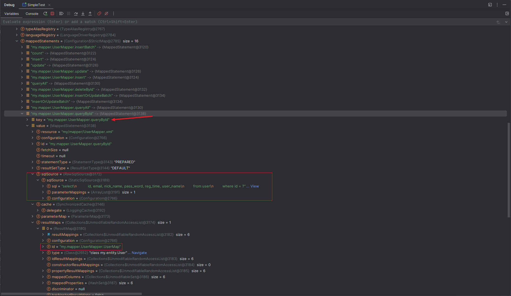
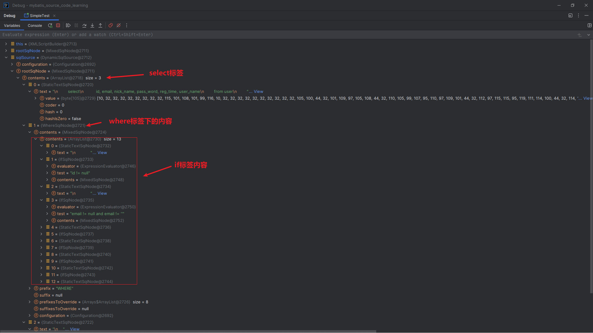

## 1 构建
### 1 解析入口   
先写一个基本的mybatis使用例子，代码在`my/SimpleTest.java`
```java
public static void main(String[] args) throws IOException {
    String resource = "my/mybatis-config.xml";
    InputStream inputStream = Resources.getResourceAsStream(resource);
    //创建SqlSessionFacory  .build构建配置文件入口,这里主要解析mybatis-config.xml、mapper.xml以及mapper接口
    SqlSessionFactory sqlSessionFactory = new SqlSessionFactoryBuilder().build(inputStream);
    // 这里主要是获取执行器
    SqlSession sqlSession = sqlSessionFactory.openSession();
    //获取Mapper，这里主要是代理生成mapper的代理对象
    UserMapper mapper = sqlSession.getMapper(UserMapper.class);
    // 单个返回user测试
    User user = mapper.queryById(1L);
    System.out.println(user);
    sqlSession.commit();
    sqlSession.close();
  }
```
>这里先加载了mybatis-config.xml文件，如何通过`SqlSessionFactoryBuilder().build(inputStream)`方法创建了`SqlSessionFactory`
从这里可知，这里就是解析配置文件的入口， 
> 
我们从这里开始
### 1 解析mybatis-config.xml文件   
**先进入`SqlSessionFactoryBuilder.build()`方法**
```java
public SqlSessionFactory build(InputStream inputStream, String environment, Properties properties) {
    try {
      // 这里面主要是XPathParser类对mybatis-config.xml文件进行SAX解析，生成Document对象
      XMLConfigBuilder parser = new XMLConfigBuilder(inputStream, environment, properties);
      // 解析配置文件 重点看parse()方法 ↓↓↓
      return build(parser.parse());
    } catch (Exception e) {
      throw ExceptionFactory.wrapException("Error building SqlSession.", e);
    } finally {
      ErrorContext.instance().reset();
      try {
        if (inputStream != null) {
          inputStream.close();
        }
      } catch (IOException e) {
        // Intentionally ignore. Prefer previous error.
      }
    }
  }
```
>这里主要是通过xml解析类`XPathParser`解析xml文件生成文档树，把解析对象封装到XMLConfigBuilder返回。  
> 
**再看看`build()`方法**
```java
public SqlSessionFactory build(Configuration config) {
    // 配置文件解析完，Configuration注入到SqlSessionFactory中
    return new DefaultSqlSessionFactory(config);
  }
```
>`build()`方法接收一个Configuration对象，并且把该对象注入到自己的属性中，可以看出`parse()`方法返回一个Configuration对象，也就是配置文件最后   
> 
解析生成一个Configuration对象。  
**进入`XMLConfigBuilder.parse()` ↓↓↓**
```java
public Configuration parse() {
    // 判断是否解析过
    if (parsed) {
      throw new BuilderException("Each XMLConfigBuilder can only be used once.");
    }
    parsed = true;
    // 解析 <configuration></configuration>标签内容，标签内容经过XPathParser解析，生成对象XNode
    parseConfiguration(parser.evalNode("/configuration"));
    return configuration;
  }
```
>看见熟悉的configuration，我们配置文件属性都在<configuration></configuration>标签之内，这里开始解析配置文件。   
> 
进入`parseConfiguration()`
```java
private void parseConfiguration(XNode root) {
    try {
      // issue #117 read properties first
      // 把properties标签属性值解析到configuration和XPathParser属性variables中
      propertiesElement(root.evalNode("properties"));
      Properties settings = settingsAsProperties(root.evalNode("settings"));
      // 虚拟文件加载系统
      loadCustomVfs(settings);
      // 加载日志实现类
      loadCustomLogImpl(settings);
      // 解析别名 注入到typeAliasRegistry属性中，key=别名，value=class类型
      typeAliasesElement(root.evalNode("typeAliases"));
      // 解析插件 注入到 interceptorChain属性中
      pluginElement(root.evalNode("plugins"));
      // 每次 MyBatis 创建结果对象的新实例时，它都会使用一个对象工厂（ObjectFactory）实例来完成实例化工作。可以配置覆盖默认的
      objectFactoryElement(root.evalNode("objectFactory"));
      objectWrapperFactoryElement(root.evalNode("objectWrapperFactory"));
      // 反射工厂 MyBatis 用于缓存 Reflector 的功能
      reflectorFactoryElement(root.evalNode("reflectorFactory"));
      // 解析设置标签
      settingsElement(settings);
      // read it after objectFactory and objectWrapperFactory issue #631
      // 环境配置（environments），配置数据源信息，也可配置多数据源，但是每个数据库对应一个 SqlSessionFactory 实例
      environmentsElement(root.evalNode("environments"));
      // 数据库厂商标识（databaseIdProvider）根据不同的数据库标识，生成不同的SQL，比如Oracle sqlserver
      databaseIdProviderElement(root.evalNode("databaseIdProvider"));
      // 类型处理器（typeHandlers）MyBatis 在设置预处理语句（PreparedStatement）中的参数或从结果集中取出一个值时，
      // 都会用类型处理器将获取到的值以合适的方式转换成 Java 类型。这里可以重写已有的类型处理器或创建你自己的类型处理器来处理不支持的或非标准的类型
      typeHandlerElement(root.evalNode("typeHandlers"));
      // 这里就是最关键的SQL映射语句了，解析mapper接口和mapper.xml，生成对应的MappedStatement
      mapperElement(root.evalNode("mappers"));
    } catch (Exception e) {
      throw new BuilderException("Error parsing SQL Mapper Configuration. Cause: " + e, e);
    }
  }
```
>这部分内容对<configuration></configuration>标签内的各标签顺序解析，每个标签基本Configuration对象都有对应的属性，这里解析完标签内容
都会注入到Configuration对象中，各标签属性内容可参照官网[mybatis配置属性](https://mybatis.org/mybatis-3/zh/configuration.html)
可点击进去看看具体解析细节，我们这里关注一下`mapperElement(root.evalNode("mappers"))`方法，进行mapper接口和mapper.xml解析。   
> 
### 2 mapper解析
**进入`mapperElement(root.evalNode("mappers"))` ↓↓↓**
```java
private void mapperElement(XNode parent) throws Exception {
    if (parent != null) {
      // mapper映射器的写法 package优先级高于resource、url、class
      for (XNode child : parent.getChildren()) {
        if ("package".equals(child.getName())) {
          // 解析package写法mapper，获取到mapper包名，其他写法类似
          String mapperPackage = child.getStringAttribute("name");
          configuration.addMappers(mapperPackage);
        } else {
          //resource、url、class 只能有一个
          String resource = child.getStringAttribute("resource");
          String url = child.getStringAttribute("url");
          String mapperClass = child.getStringAttribute("class");
          if (resource != null && url == null && mapperClass == null) {
            ErrorContext.instance().resource(resource);
            // 加载文件
            try (InputStream inputStream = Resources.getResourceAsStream(resource)) {
              XMLMapperBuilder mapperParser = new XMLMapperBuilder(inputStream, configuration, resource,
                  configuration.getSqlFragments());
              // 解析mapper
              mapperParser.parse();
            }
          } else if (resource == null && url != null && mapperClass == null) {
            ErrorContext.instance().resource(url);
            try (InputStream inputStream = Resources.getUrlAsStream(url)) {
              XMLMapperBuilder mapperParser = new XMLMapperBuilder(inputStream, configuration, url,
                  configuration.getSqlFragments());
              // 解析mapper
              mapperParser.parse();
            }
          } else if (resource == null && url == null && mapperClass != null) {
            Class<?> mapperInterface = Resources.classForName(mapperClass);
            configuration.addMapper(mapperInterface);
          } else {
            throw new BuilderException(
                "A mapper element may only specify a url, resource or class, but not more than one.");
          }
        }
      }
    }
  }
```
mapper配置有3中写法，如下所示：
```xml
<mappers>
     <mapper resource="my/mapper/UserMapper.xml"/>
    <!--  <mapper class="my.mapper.UserMapper"></mapper>-->
    <!-- 使用完全限定资源定位符（URL）一般用于远程资源-->
    <!--  <mapper url="file:///var/mapper/UserMapper.xml"/>-->
    <!--使用package，接口和xml必须在同一个包内-->
    <!-- <package name="my/mapper"/>-->
  </mappers>
```
>这里是对不同写法mapper配置进行解析，基本都是一样，先获取文件流，再通过`XMLMapperBuilder`进行解析。对于通过`package`写法，会遍历包下的所有文件
再进行解析，解析逻辑和resource、url、class写法一样，这里是resource写法。  
> 
我们进入`parse()`方法   
```java
 public void parse() {
        // 判断该mapper是否已经解析过
        if (!configuration.isResourceLoaded(resource)) {
        // 解析mapper标签<mapper><mapper/>
        configurationElement(parser.evalNode("/mapper"));
        // 解析完该mapper.xml，放进set集合中，表示已解析
        configuration.addLoadedResource(resource);
        // 解析完把该mapper接口注册到Configuration对象中，就是把该mapper接口放到Configuration的mapperRegistry属性中，该属性对象有关键map类型属性knownMappers
        bindMapperForNamespace();
        }
        // 重新解析之前有问题的标签
        parsePendingResultMaps();
        parsePendingCacheRefs();
        parsePendingStatements();
        }
```
>进来先判断是否已经解析过该xml文件，没有则开始解析<mapper/>标签，对于mapper.xml，我们的所有配置都放在mapper标签之内。  
> 
  继续进入`configurationElement()`方法
```java
private void configurationElement(XNode context) {
    try {
      // 获取namespace属性值
      String namespace = context.getStringAttribute("namespace");
      if (namespace == null || namespace.isEmpty()) {
        throw new BuilderException("Mapper's namespace cannot be empty");
      }
      // 绑定当前解析的namespace值
      builderAssistant.setCurrentNamespace(namespace);
      // 解析缓存配置表标签，这里是二级缓存 官网文档：https://mybatis.org/mybatis-3/zh/sqlmap-xml.html#%E7%BC%93%E5%AD%98
      cacheRefElement(context.evalNode("cache-ref"));
      cacheElement(context.evalNode("cache"));
      // parameterMap – 老式风格的参数映射。此元素已被废弃，并可能在将来被移除！请使用行内参数映射
      parameterMapElement(context.evalNodes("/mapper/parameterMap"));
      // 解析结果映射
      resultMapElements(context.evalNodes("/mapper/resultMap"));
      // 解析sql标签，可重用的 SQL 代码片段
      sqlElement(context.evalNodes("/mapper/sql"));
      // 解析真正的SQL语句 select|insert|update|delete
      buildStatementFromContext(context.evalNodes("select|insert|update|delete"));
    } catch (Exception e) {
      throw new BuilderException("Error parsing Mapper XML. The XML location is '" + resource + "'. Cause: " + e, e);
    }
  }
```
>这里是对mapper标签下的各标签进行解析，可参照官网[xml映射器](https://mybatis.net.cn/sqlmap-xml.html) 标签包括
>- cache – 该命名空间的缓存配置。
>- cache-ref – 引用其它命名空间的缓存配置。
>- resultMap – 描述如何从数据库结果集中加载对象，是最复杂也是最强大的元素。
>- parameterMap – 老式风格的参数映射。此元素已被废弃，并可能在将来被移除！请使用行内参数映射。
>- sql – 可被其它语句引用的可重用语句块。
>- insert – 映射插入语句。
>- update – 映射更新语句。
>- delete – 映射删除语句。
>- select – 映射查询语句。     
>
这里我们不妨停下来看一下，在方法末尾打个断点，看看解析的数据，是以什么样的形式保存在Configuration对象中   
我们的UserMapper.xml文件如下所示:
```xml
<?xml version="1.0" encoding="UTF-8"?>
<!DOCTYPE mapper PUBLIC "-//mybatis.org//DTD Mapper 3.0//EN" "http://mybatis.org/dtd/mybatis-3-mapper.dtd">
<mapper namespace="my.mapper.UserMapper">

  <!--开启二级缓存-->
  <cache />
  <resultMap type="my.entity.User" id="UserMap">
    <result property="id" column="id" jdbcType="INTEGER"/>
    <result property="email" column="email" jdbcType="VARCHAR"/>
    <result property="nickName" column="nick_name" jdbcType="VARCHAR"/>
    <result property="passWord" column="pass_word" jdbcType="VARCHAR"/>
    <result property="regTime" column="reg_time" jdbcType="VARCHAR"/>
    <result property="userName" column="user_name" jdbcType="VARCHAR"/>
  </resultMap>

  <!--查询单个-->
  <select id="queryById" resultMap="UserMap">
    select
    id, email, nick_name, pass_word, reg_time, user_name
    from user
    where id = #{id}
  </select>

  <!--查询指定行数据-->
  <select id="queryAll" resultMap="UserMap">
    select
    id, email, nick_name, pass_word, reg_time, user_name
    from user
    <where>
      <if test="id != null">
        and id = #{id}
      </if>
      <if test="email != null and email != ''">
        and email = #{email}
      </if>
      <if test="nickName != null and nickName != ''">
        and nick_name = #{nickName}
      </if>
      <if test="passWord != null and passWord != ''">
        and pass_word = #{passWord}
      </if>
      <if test="regTime != null and regTime != ''">
        and reg_time = #{regTime}
      </if>
      <if test="userName != null and userName != ''">
        and user_name = #{userName}
      </if>
    </where>
  </select>

  <!--统计总行数-->
  <select id="count" resultType="java.lang.Long">
    select count(1)
    from user
    <where>
      <if test="id != null">
        and id = #{id}
      </if>
      <if test="email != null and email != ''">
        and email = #{email}
      </if>
      <if test="nickName != null and nickName != ''">
        and nick_name = #{nickName}
      </if>
      <if test="passWord != null and passWord != ''">
        and pass_word = #{passWord}
      </if>
      <if test="regTime != null and regTime != ''">
        and reg_time = #{regTime}
      </if>
      <if test="userName != null and userName != ''">
        and user_name = #{userName}
      </if>
    </where>
  </select>

  <!--新增所有列-->
  <insert id="insert" keyProperty="id" useGeneratedKeys="true">
    insert into user(email, nick_name, pass_word, reg_time, user_name)
    values (#{email}, #{nickName}, #{passWord}, #{regTime}, #{userName})
  </insert>

  <insert id="insertBatch" keyProperty="id" useGeneratedKeys="true">
    insert into user(email, nick_name, pass_word, reg_time, user_name)
    values
    <foreach collection="entities" item="entity" separator=",">
      (#{entity.email}, #{entity.nickName}, #{entity.passWord}, #{entity.regTime}, #{entity.userName})
    </foreach>
  </insert>

  <insert id="insertOrUpdateBatch" keyProperty="id" useGeneratedKeys="true">
    insert into user(email, nick_name, pass_word, reg_time, user_name)
    values
    <foreach collection="entities" item="entity" separator=",">
      (#{entity.email}, #{entity.nickName}, #{entity.passWord}, #{entity.regTime}, #{entity.userName})
    </foreach>
    on duplicate key update
    email = values(email),
    nick_name = values(nick_name),
    pass_word = values(pass_word),
    reg_time = values(reg_time),
    user_name = values(user_name)
  </insert>

  <!--通过主键修改数据-->
  <update id="update">
    update user
    <set>
      <if test="email != null and email != ''">
        email = #{email},
      </if>
      <if test="nickName != null and nickName != ''">
        nick_name = #{nickName},
      </if>
      <if test="passWord != null and passWord != ''">
        pass_word = #{passWord},
      </if>
      <if test="regTime != null and regTime != ''">
        reg_time = #{regTime},
      </if>
      <if test="userName != null and userName != ''">
        user_name = #{userName},
      </if>
    </set>
    where id = #{id}
  </update>

  <!--通过主键删除-->
  <delete id="deleteById">
    delete from user where id = #{id}
  </delete>

</mapper>
```

>从debug截图可以看到，Configuration属性mappedStatements属性，就是一个map类型，其key的值为mapper.xml的namespace+id，value=解析每个增删改查
>语句封装成的mappedStatement，SQL语句封装在sqlSource对象中，其他属性也一一对应标签属性。看到了mappedStatements的封装结果，接下看看它是如何解析的。  
>
  **进入解析增删改查节点的方法`buildStatementFromContext()`。**
```java
private void buildStatementFromContext(List<XNode> list, String requiredDatabaseId) {
    // 遍历增删改查标签，进行解析
    for (XNode context : list) {
      // 取出其中一个sql标签构造XMLStatementBuilder，主要是带上configuration对象
      final XMLStatementBuilder statementParser = new XMLStatementBuilder(configuration, builderAssistant, context,
          requiredDatabaseId);
      try {
        // 解析生成MappedStatement
        statementParser.parseStatementNode();
      } catch (IncompleteElementException e) {
        // 这里是前面顺序解析时，无法解析放进去这里，比如引用了<sql>标签，但是<sql>标签写在后面
        configuration.addIncompleteStatement(statementParser);
      }
    }
  }
```
>这里遍历增删改查节点，逐个解析，对于一些标签引用了其他未解析标签，就无法解析，这里做法是先拿出来不解析，后面该mapper.xml其他标签解析完了，
> 再重新解析。
> 
**继续进入`statementParser.parseStatementNode()`方法**
```java
public void parseStatementNode() {
    // 标签id 比如 queryById
    String id = context.getStringAttribute("id");
    // 数据库厂商标识
    String databaseId = context.getStringAttribute("databaseId");

    if (!databaseIdMatchesCurrent(id, databaseId, this.requiredDatabaseId)) {
      return;
    }

    // 获取当前的标签名称 比如 select
    String nodeName = context.getNode().getNodeName();
    SqlCommandType sqlCommandType = SqlCommandType.valueOf(nodeName.toUpperCase(Locale.ENGLISH));
    // 是否select语句
    boolean isSelect = sqlCommandType == SqlCommandType.SELECT;
    // 将其设置为 true 后，只要语句被调用，都会导致本地缓存和二级缓存被清空，默认值：false。
    boolean flushCache = context.getBooleanAttribute("flushCache", !isSelect);
    // 将其设置为 true 后，将会导致本条语句的结果被二级缓存缓存起来，默认值：对 select 元素为 true。
    boolean useCache = context.getBooleanAttribute("useCache", isSelect);
    // 这个设置仅针对嵌套结果 select 语句
    boolean resultOrdered = context.getBooleanAttribute("resultOrdered", false);

    // Include Fragments before parsing
    XMLIncludeTransformer includeParser = new XMLIncludeTransformer(configuration, builderAssistant);
    // include标签
    includeParser.applyIncludes(context.getNode());

    // 参数类型
    String parameterType = context.getStringAttribute("parameterType");
    Class<?> parameterTypeClass = resolveClass(parameterType);

    String lang = context.getStringAttribute("lang");
    LanguageDriver langDriver = getLanguageDriver(lang);

    // Parse selectKey after includes and remove them.
    // 解析selectKey标签（给没有自动生成主键功能的数据库类型自动生成主键，没用过）和includes标签
    processSelectKeyNodes(id, parameterTypeClass, langDriver);

    // Parse the SQL (pre: <selectKey> and <include> were parsed and removed)
    // 主键自增配置
    KeyGenerator keyGenerator;
    String keyStatementId = id + SelectKeyGenerator.SELECT_KEY_SUFFIX;
    keyStatementId = builderAssistant.applyCurrentNamespace(keyStatementId, true);
    if (configuration.hasKeyGenerator(keyStatementId)) {
      keyGenerator = configuration.getKeyGenerator(keyStatementId);
    } else {
      keyGenerator = context.getBooleanAttribute("useGeneratedKeys",
          configuration.isUseGeneratedKeys() && SqlCommandType.INSERT.equals(sqlCommandType))
              ? Jdbc3KeyGenerator.INSTANCE : NoKeyGenerator.INSTANCE;
    }
    // 这里解析sql，把语句中的where、if标签解析，封装到SqlSource ↓↓↓ XMLLanguageDriver.createSqlSource()
    SqlSource sqlSource = langDriver.createSqlSource(configuration, context, parameterTypeClass);
    // 以下属性获取，可参照 https://mybatis.org/mybatis-3/zh/sqlmap-xml.html#select-1
    StatementType statementType = StatementType
        .valueOf(context.getStringAttribute("statementType", StatementType.PREPARED.toString()));
    Integer fetchSize = context.getIntAttribute("fetchSize");
    // 驱动程序等待数据库返回请求结果的秒数
    Integer timeout = context.getIntAttribute("timeout");
    String parameterMap = context.getStringAttribute("parameterMap");
    // 结果映射类型，最后还是会解析成resultMap
    String resultType = context.getStringAttribute("resultType");
    Class<?> resultTypeClass = resolveClass(resultType);
    // 结果映射
    String resultMap = context.getStringAttribute("resultMap");
    if (resultTypeClass == null && resultMap == null) {
      resultTypeClass = MapperAnnotationBuilder.getMethodReturnType(builderAssistant.getCurrentNamespace(), id);
    }
    String resultSetType = context.getStringAttribute("resultSetType");
    ResultSetType resultSetTypeEnum = resolveResultSetType(resultSetType);
    if (resultSetTypeEnum == null) {
      resultSetTypeEnum = configuration.getDefaultResultSetType();
    }
    // 这些属性对应insert, update 和 delete标签 https://mybatis.org/mybatis-3/zh/sqlmap-xml.html#insert-update-%E5%92%8C-delete
    String keyProperty = context.getStringAttribute("keyProperty");
    String keyColumn = context.getStringAttribute("keyColumn");
    String resultSets = context.getStringAttribute("resultSets");
    boolean dirtySelect = context.getBooleanAttribute("affectData", Boolean.FALSE);
    // 把上述属性解析封装成MappedStatement，放在configuration对象中
    builderAssistant.addMappedStatement(id, sqlSource, statementType, sqlCommandType, fetchSize, timeout, parameterMap,
        parameterTypeClass, resultMap, resultTypeClass, resultSetTypeEnum, flushCache, useCache, resultOrdered,
        keyGenerator, keyProperty, keyColumn, databaseId, langDriver, resultSets, dirtySelect);
  }
```
>这个方法代码很长，但是不复杂。这里主要对增删改查语句解析，获取标签的各种属性，如何封装成mappedStatement。标签属性可以参照[mybatis xml映射器](https://mybatis.net.cn/sqlmap-xml.html#select)，
接下来最重要的SQL解析，入口在`SqlSource sqlSource = langDriver.createSqlSource(configuration, context, parameterTypeClass);`方法中。   
> 
该方法最后来到`XMLScriptBuilder.parseScriptNode()`,如下：
```java
public SqlSource parseScriptNode() {
        // 解析动态标签 ↓↓↓
        MixedSqlNode rootSqlNode = parseDynamicTags(context);
        SqlSource sqlSource;
        if (isDynamic) {
        // 动态标签
        sqlSource = new DynamicSqlSource(configuration, rootSqlNode);
        } else {
        // 不是动态的，直接把#{}换成？ 比如： select * from user where id = #{id}  ==>  select * from user where id = ?
        sqlSource = new RawSqlSource(configuration, rootSqlNode, parameterType);
        }
        return sqlSource;
        }
```
> 这里主要是解析动态标签，动态标签既是SQL语句中存在if、choose (when, otherwise)、trim (where, set)、foreach标签，对于简单的静态标签
> 则直接进行参数替换，即把#{}替换成？，如果是${}则不动，在执行的时候直接进行值替换。
>
**再进入方法`parseDynamicTags(context)`:**
```java
protected MixedSqlNode parseDynamicTags(XNode node) {
    List<SqlNode> contents = new ArrayList<>();
    // 获取所有的子标签，比如where、if、foreach
    NodeList children = node.getNode().getChildNodes();
    for (int i = 0; i < children.getLength(); i++) {
      XNode child = node.newXNode(children.item(i));
      if (child.getNode().getNodeType() == Node.CDATA_SECTION_NODE || child.getNode().getNodeType() == Node.TEXT_NODE) {
        String data = child.getStringBody("");
        TextSqlNode textSqlNode = new TextSqlNode(data);
        if (textSqlNode.isDynamic()) {
          // 动态SQL
          contents.add(textSqlNode);
          isDynamic = true;
        } else {
          contents.add(new StaticTextSqlNode(data));
        }
      } else if (child.getNode().getNodeType() == Node.ELEMENT_NODE) { // issue #628
        // 这里解析where、if、foreach之类动态拼接SQL的标签
        String nodeName = child.getNode().getNodeName();
        NodeHandler handler = nodeHandlerMap.get(nodeName);
        if (handler == null) {
          throw new BuilderException("Unknown element <" + nodeName + "> in SQL statement.");
        }
        // 处理不同类型的动态标签
        handler.handleNode(child, contents);
        isDynamic = true;
      }
    }
    // 最后contents内容 大概就是树形结构  where -> if
    return new MixedSqlNode(contents);
  }
```
>这段解析内容蛮绕的，建议边debug边阅读。如果是静态标签，直接`contents.add(textSqlNode);`如果是动态标签，这是是递归解析，主要方法是在
> `handler.handleNode(child, contents);`该不同的动态标签有不同的handler实现，里面又调用了`parseDynamicTags(context)`方法，实现递归
> 解析。对于如下所示动态标签：
> 
 ```xml
<!--查询指定行数据-->
    <select id="queryAll" resultMap="UserMap">
        select
          id, email, nick_name, pass_word, reg_time, user_name
        from user
        <where>
            <if test="id != null">
                and id = #{id}
            </if>
            <if test="email != null and email != ''">
                and email = #{email}
            </if>
            <if test="nickName != null and nickName != ''">
                and nick_name = #{nickName}
            </if>
            <if test="passWord != null and passWord != ''">
                and pass_word = #{passWord}
            </if>
            <if test="regTime != null and regTime != ''">
                and reg_time = #{regTime}
            </if>
            <if test="userName != null and userName != ''">
                and user_name = #{userName}
            </if>
        </where>
    </select>
```
>最后解析的结果如下所示：
> 

### 总结
这里配置文件及mapper文件解析基本完成，总结一下：
- 这阶段解析了两个配置文件，分别是mybatis-config.xml文件以及mapper.xml映射文件。
- 对于mybatis-config.xml文件主要通过`XMLConfigBuilder`类解析，把解析的内容直接注入到Configuration对象属性中。
- 对于mapper.xml映射文件主要通过`XMLMapperBuilder`类解析，把解析内容封装成一个MappedStatement，也注入到Configuration对象中。   

这只是大概流程，还有很多细节可以探索，比如如何把把#{}替换成？，这里相关代码没有贴出来，在仓库源码也有相关注释，可自行探索。